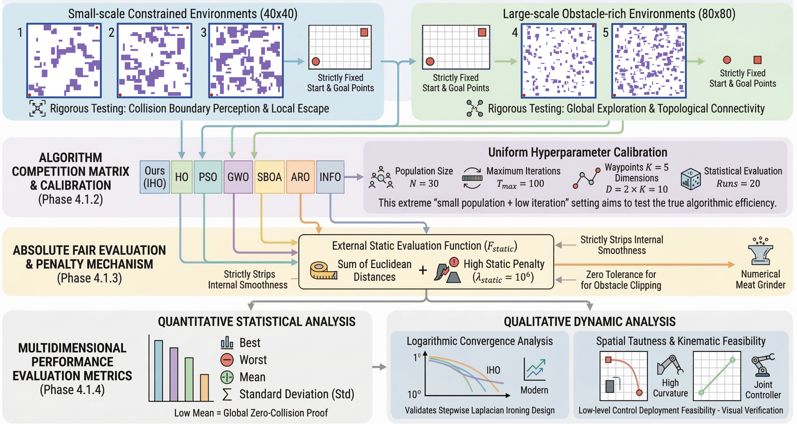
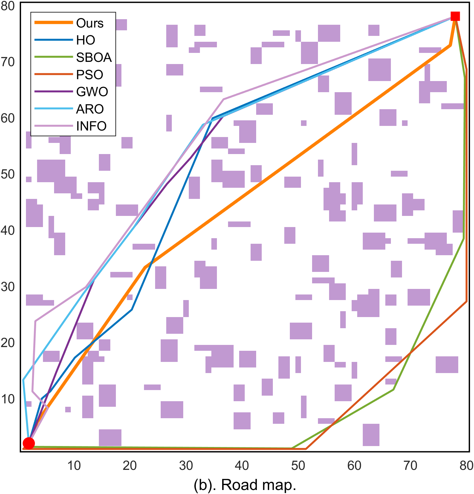
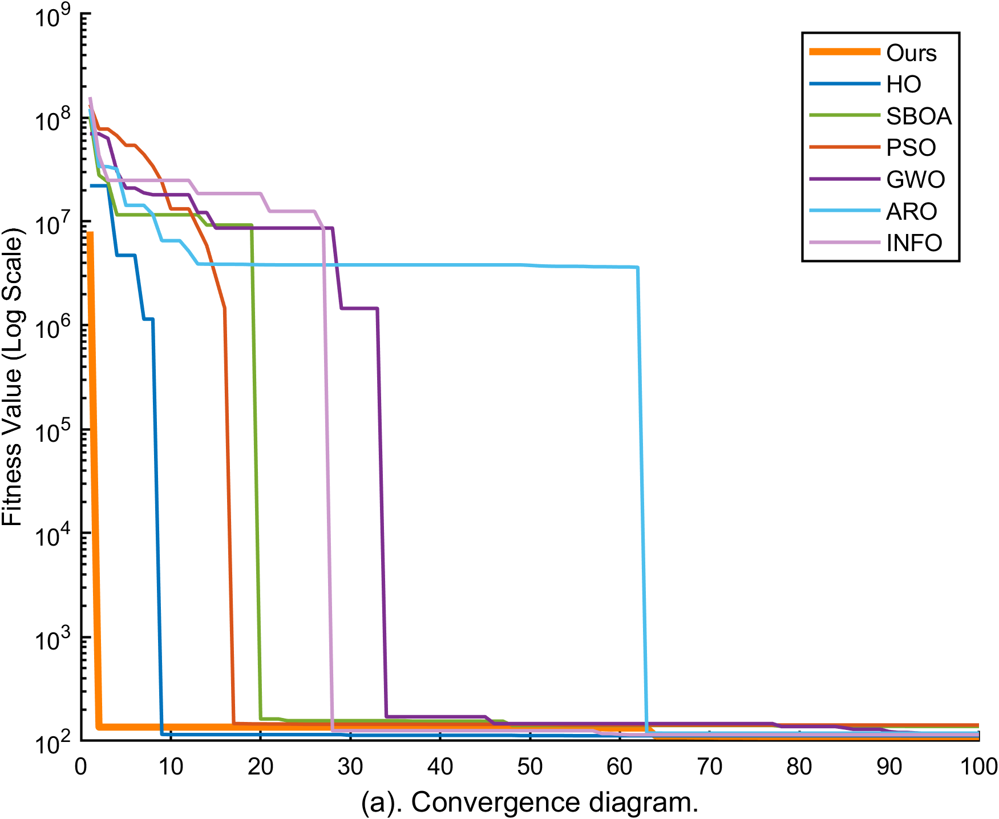

# 🦛 动力学感知改进河马优化算法（IHO）用于机器人路径规划

[](https://www.mathworks.com/products/matlab.html)
[](https://creativecommons.org/licenses/by-nc-sa/4.0/)
[]()

> 本仓库为以下论文的官方代码实现：
> **《Kinematic-Aware Improved Hippo Optimization with Laplacian Ironing for Swarm-based Path Planning in Cluttered Environments》**（审稿中）

---

## 🌐 语言版本

[English](README.md) | [中文](README_zh.md)

---

## 💡 核心贡献

### 1️⃣ 动力学感知约束（Kinematic-Aware Constraint）

在群智能优化过程中引入机器人**非完整运动学约束**，从搜索空间层面剔除不可执行解（如原地急转、锐角路径等），从而：

* 保证路径物理可行性
* 降低后处理或轨迹重规划需求
* 支持真实移动机器人与四足机器人直接部署

---

### 2️⃣ 拉普拉斯熨斗算子（Laplacian Ironing Operator）

受几何信号处理启发，提出一种用于路径优化后期的平滑机制：

* 对离散航点进行拓扑张力释放
* 提升路径连续性与曲率平滑性
* 在收敛后期产生明显的**“断崖式收敛（Cliff-like Convergence）”现象**

---

## 🏗️ 基准测试体系

构建了包含 **5种不同复杂度环境** 的标准测试框架：

* 小尺度狭窄通道($40 \times 40$)
* 大尺度复杂迷宫($80 \times 80$)

所有算法在统一条件下评估，并采用严格碰撞惩罚项：

$$
\lambda_{static} = 10^6
$$

实现**零容忍碰撞约束**，确保评估公平性与工程意义。

<p align="center">
  
  <br>
  <em>图1：多维度评估体系与算法对比框架</em>
</p>

---


## 🎥 实机验证 (Hardware Validation)

本文提出的算法已在真实的移动机器人平台上进行了全流程验证，覆盖了多种高约束的复杂障碍物环境。

<p align="center">
  
  <br>
  <em>图 2. 大尺度复杂迷宫环境 (Map 5) 实机导航效果。移动机器人完美执行了 IHO 规划的路径，在狭窄走廊中表现出极高的平滑度，彻底消除了物理不可行的锐角转向，确保了导航的安全性和稳定性。</em>
</p>


---

## 📊 实验结果与对比分析

对比算法包括：

* HO（原始河马优化）
* SBOA
* ARO
* INFO
* PSO
* GWO

### 主要结论：

* 在小种群规模($N = 30$)下仍实现 **100% 无碰撞路径**
* 路径在长度与平滑性上均优于对比方法
* 收敛曲线后期呈现明显的**加速下降特性**

<p align="center">
  
  
  <br>
  <em>Map 4 对比：IHO（蓝色）生成更平滑路径，并表现出断崖式收敛趋势</em>
</p>

---

## 📂 项目结构

```text
Kinematic-Aware-IHO/
├── src/                     # 算法与环境代码
│   ├── main.m              # 主程序入口
│   ├── IHO_Planner.m      # IHO核心算法
│   ├── HO_Planner.m       # 原始HO算法
│   └── ...                # 其他对比算法（PSO/GWO等）
├── results/               # 路径与收敛结果
├── assets/                # 论文图示
└── hardware_demos/        # 实机演示视频
```

---

## ⚙️ 环境依赖

* 操作系统：Windows / Ubuntu / macOS
* MATLAB：R2023b 或更高版本（推荐）
* 工具箱：无需额外工具箱（仅使用基础函数）

---

## 🚀 快速开始

```bash
git clone https://github.com/Yule-Cai/Kinematic-Aware-IHO.git
```

使用步骤：

1. 打开 MATLAB
2. 进入 `src/` 目录
3. 运行：

```matlab
main.m
```

---

## 📄 开源协议

本项目基于 **CC BY-NC-SA 4.0** 协议开源。

© 2026 Yule Cai


